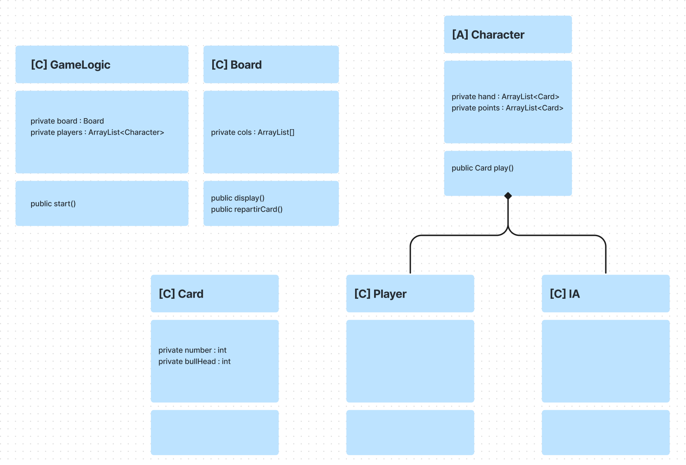

# 6QuiPrend
Projet en groupe - ISEP A1

Le jeu propose un mode "local" permettant de jouer face à 1 à 9 opposants, IA ou joueurs.

## Règle du jeu
Le jeu se joue avec un jeu de 104 cartes numérotées de 1 à 104. Chaque carte possède un nombre de têtes de bœufs (représenté par des cornes) allant de 1 à 7. Chaque joueur reçoit 10 cartes au début de la partie. Le but du jeu est de se débarrasser de ses cartes en les posant sur l'une des 4 rangées de cartes. Chaque rangée ne peut contenir que 5 cartes. Si le joueur pose la 6e carte sur une rangée, il doit prendre les 5 cartes de la rangée et les ajouter à son total. Si le joueur pose une carte inférieur aux cartes aux extrémités de chaque rangées, il choisit une rangée à ramasser et ajouter à son total de points.

Le joueur ayant le moins de têtes de boeufs à la fin des 10 tours, gagne.

## Ressources
Lien du figma (diagrams) : https://www.figma.com/file/1k6KravPKXAwT8NdUPwtKa/6QuiPrendClassDiagram?node-id=0%3A1&t=0lwmRXDbM4ImyTVF-1

